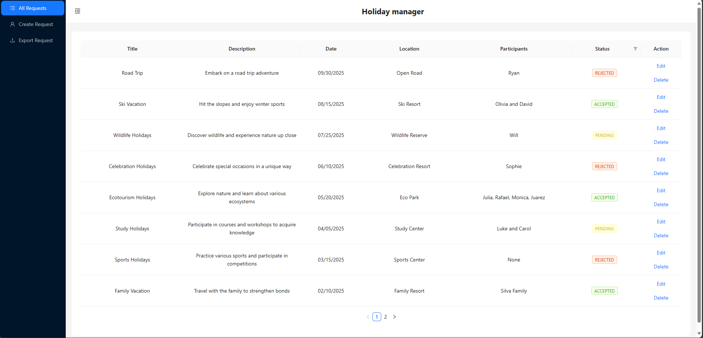
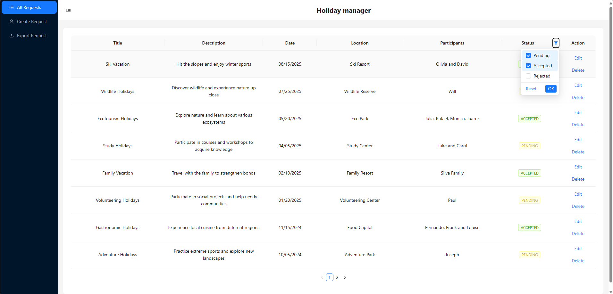
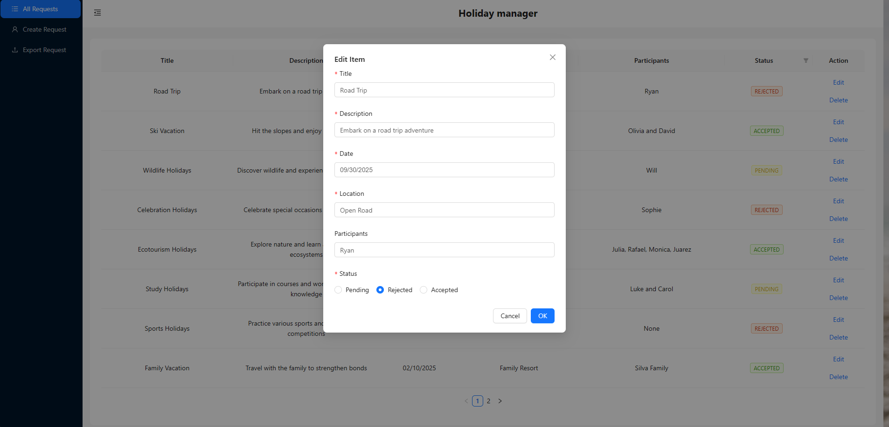
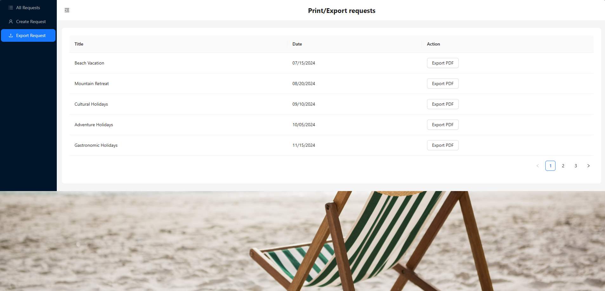
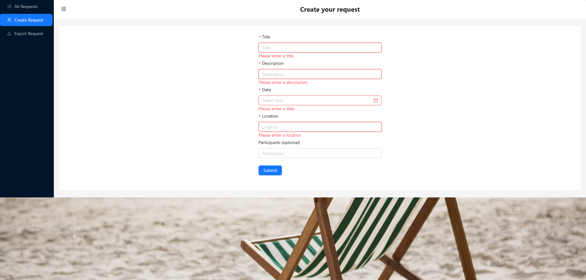
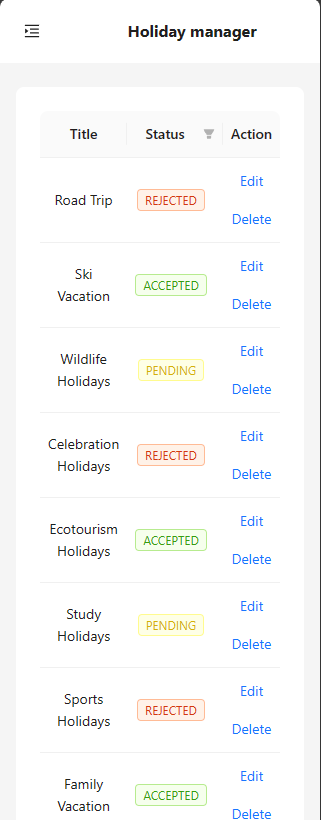

<div align="center">

<h1 align="center">Holiday Manager - Your Vacation Planning Solution! 🌴🌞</h1>

<h1 align="center">
    <a href="#">🔗 Click here to access the Holiday Manager</a>
</h1>

<p align="center">🚀 A vacation plan management interface for organizing and managing your holidays with ease.</p>

<h4 align="center"> 
	✅ Holiday Manager 🌴🌞 Project completed.  ✅
</h4>
</div>

### 🛠️ Installation
---
To install and run this project locally, follow these steps:

1.  Clone the repository in your machine:

    ```sh
    git clone https://github.com/StaanB/holiday-manager.git
    ```

2.  Navigate to the project directory:

    ```sh
    cd holiday-manager
    ```

3.  Install dependencies using npm, yarn or pnpm:

    ```sh
    npm install
    ```

    ```sh
    yarn install
    ```

    ```sh
    pnpm install
    ```

4.  Start the development server using npm, yarn or pnpm:

    ```sh
    npm run dev
    ```

    ```sh
    yarn dev
    ```

    ```sh
    pnpm dev
    ```

5.  Open your browser and go to http://localhost:3000 (or another local server) to access Holiday Manager.
<br/>   
<br/>

### ✅ Objective
---
<p>💡 The main goal of Holiday Manager is to provide a user-friendly interface for managing vacation plans. Users can create, view, edit, and delete vacation plans, making it easy to organize their holidays.</p>
<br/>   
<br/> 

### 💻 Technologies
---
<h2>List of technologies used in this project: </h2>

- **ReactJS** - Front-end framework for building user interfaces
- **TypeScript** - Typed superset of JavaScript that compiles to plain JavaScript
- **Ant Design** - React UI library with a set of high-quality components and demos for building rich, interactive user interfaces
- **Node.js** - JavaScript runtime for building server-side applications
- **Express** - Fast, unopinionated, minimalist web framework for Node.js
- **JSON Server** - Fake REST API to use for prototyping and mocking
- **Cypress** - JavaScript testing framework for end-to-end testing
  
<br/>   
<br/>

### 💡Features
---
- [x] Create, view, filter, edit, and delete vacation plans.
- [x] Display vacation plans with titles, descriptions, dates, locations, and participants.
- [x] Generate PDF/print mode for vacation plans.
- [x] Client-side form validation for input fields.
- [x] Responsive design for various devices and screen sizes.
<br/>   
<br/> 

### 📚 Documentation
---

1. View Vacation Plans
 - To view all vacation plans, navigate to the "All Requests" page from the sidebar menu.
 - Here you can see a list of all your vacation plans with details.
<br/>

2. Delete a Vacation Plan
 - To delete a vacation plan, click on the "Delete" button next to the plan you want to delete.
<br/>

   
 
 
---

3. Filter a Vacation Plan
 - To filter a vacation plan, click on the filter icon button next to the status.
 - Filter what status you want
<br/>

   
 
 
---

4. Create a Vacation Plan
 - To create a new vacation plan, click on the "Create Request" button on the dashboard.
 - Fill in the required fields such as title, description, dates, location, and participants.
 - Click "Save" to create the plan.
   
 
 
<br/>

---

5. Edit a Vacation Plan
 - To edit a vacation plan, click on the "Edit" button next to the plan you want to edit.
 - Make the desired changes and click "OK" to update the plan.
   
 
 
<br/>

---

6. Generate PDF Mode
 - To generate a PDF or print mode for a vacation plan, click on the "Export PDF" button next to the plan you want to export.
   
 
 
<br/>

---

7. Client-side Form Validation
 - All input fields in the create and edit forms are validated to ensure the correct format and required fields are filled.
 - Error messages will be displayed if any validation fails.
   
 
 
<br/>

---

8. Responsive Design
 - The Holiday Manager app is designed to be responsive and work well on various devices and screen sizes.
 - The layout will adjust automatically to fit the screen, providing a seamless user experience.

 
 
   
<br/>
<br/>

<h3><a href="https://github.com/your-github-account/holiday-manager/blob/main/LICENSE">⚖️LICENSE</a></h3>

<br/>   
<br/> 

### 🧑🏻Author
---
<a href="https://github.com/StaanB">
 
 <br />
 <sub><b>Stanley Brenner</b></sub></a> <a href="https://stanley-b.vercel.app/" title="Stanley">🚀</a>

Made by Stanley 👋🏽 contact me!

[](https://www.linkedin.com/in/stanley-brenner-front-end/)
[](mailto:stanleybrenner@gmail.com)
